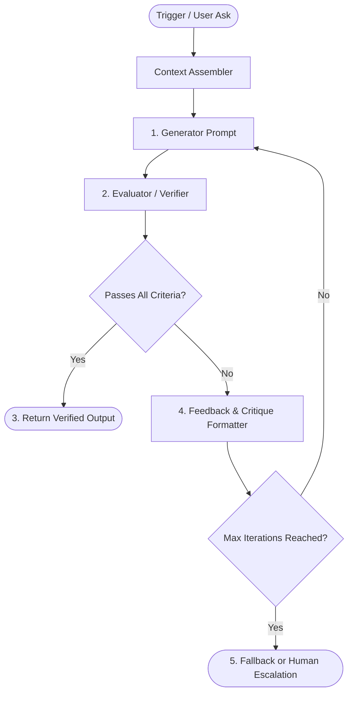

# Loop Engineering & Prompt Looping Skill

## Overview

**Loop Engineering** represents the architectural transition from *manual prompt engineering* (crafting a single, static prompt) to *control system design* (building an autonomous, self-correcting outer loop). 

Instead of expecting an LLM to produce flawless output in a single inference turn, Loop Engineering pairs a **Generator** model with a **Verifier/Evaluator**, programmatically feeding critiques back into the context until strict criteria are satisfied.



---

## The Four Pillars of a Prompting Loop

### 1. Trigger & Context Topology
* Define clear, bounded input states (session telemetry, user requirements, constraints).
* Avoid dumping unfiltered logs; assemble structured summaries that emphasize edge cases and limitations.

### 2. Generator (The Actor)
* The prompt tasked with drafting the candidate artifact (e.g., code, integrity summary, test plan).
* Must accept a structured `feedback_history` block when called in iteration $> 1$.

### 3. Verifier / Evaluator (The Ground Truth)
* **Deterministic Checks First**: Regex for forbidden patterns, schema validation (JSON Schema/Pydantic), AST parsing, test execution.
* **Rubric-Based Critique Second**: An evaluator prompt that scores the draft across explicit, orthogonal dimensions (e.g., Accuracy, Compliance, Tone, Conciseness).
* **Actionable Critiques**: The evaluator must not merely say "Rejected"; it must produce specific, bulleted instructions for the Generator to fix.

### 4. Stop Rules & Circuit Breakers
* **Convergence Condition**: Metric score $\ge \text{threshold}$ (e.g., $0.85/1.0$) and $0$ policy violations.
* **Hard Iteration Limit**: Cap at $3$ to $5$ iterations to prevent budget runaway or infinite cycles.
* **Graceful Fallback**: If max iterations are reached without passing, fallback to a safe, deterministic template or request human intervention.

---

## Implementation Patterns

### Pattern A: Evaluator-Optimizer (Quality & Compliance)
Best for text generation, compliance reports, and sensitive summaries.
```python
def evaluator_optimizer_loop(generator, evaluator, context, max_iter=3):
    feedback = []
    for turn in range(max_iter):
        draft = generator.run(context, feedback)
        eval_result = evaluator.check(draft, context)
        if eval_result.passed:
            return draft
        feedback.append(eval_result.critique)
    return fallback_safe(context)
```

### Pattern B: Ralph Loop (Test-Driven Self-Correction)
Best for code generation, bug fixing, and automated refactoring.
1. Run automated test suite (`python -m unittest` or `cargo test`).
2. If tests pass, exit loop.
3. If tests fail, extract traceback and failing assertions.
4. Inject traceback into Generator prompt: *"Fix this specific error: `<traceback>`"*.
5. Apply proposed patch and repeat.

---

## Best Practices & Anti-Patterns

| Best Practice | Why It Matters |
|---|---|
| **Orthogonal Evaluator** | Keep the evaluator distinct from the generator to prevent self-confirmation bias. |
| **Deterministic Safeguards** | Never use an LLM to check what a simple regex or unit test can verify with 100% certainty. |
| **Structured Critique History** | Label feedback clearly by iteration number so the generator sees its progression. |
| **Token Conservation** | Prune or summarize older turn feedback if context approaches window limits. |
