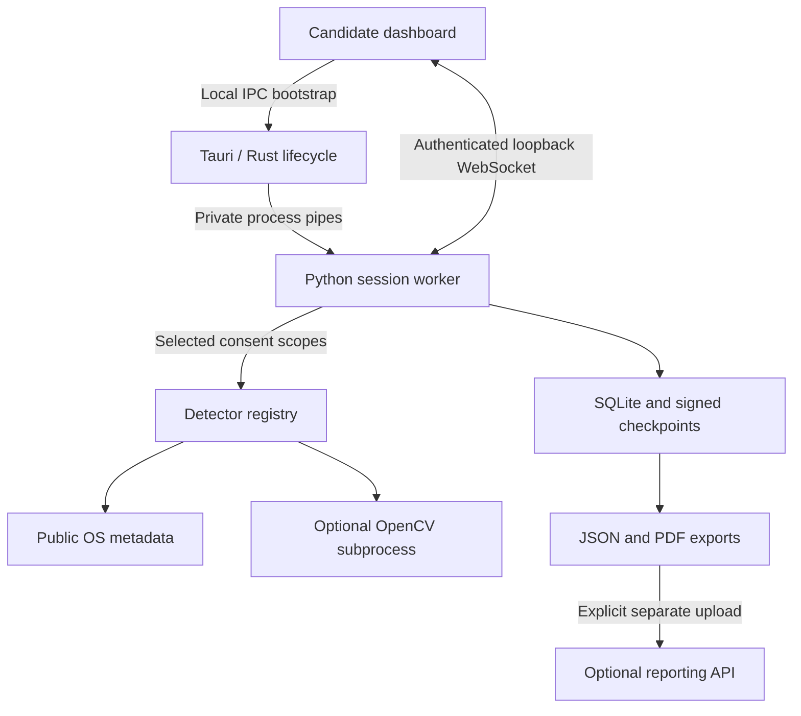

# Architecture

The desktop shell is Rust/Tauri. The session backend, native metadata collectors and OpenCV worker are Python in this prototype. This keeps the platform adapters inspectable and allows a working cross-platform development environment. It is **not a Rust detection engine**; hot paths can later move behind the same detector interface after native measurements identify a need.



## Session lifecycle

1. Rust starts the local worker with an unguessable capability token through stdin. The worker binds an ephemeral port on `127.0.0.1`. It initializes local persistence but runs no detector.
2. Rust returns the endpoint/token to its local main window. Only exact approved origins can connect; the first WebSocket message must authenticate. There is one candidate controller, and no unauthenticated observer stream.
3. The candidate accepts the current disclosure and chooses scopes. The backend validates these choices and records consent before sampling.
4. Overlay and gaze aggregates refresh approximately every 2 seconds. Process/device/display/inventory checks refresh every 10 seconds. The UI is pushed complete snapshots; history is capped at 120 graph points and 100 visible timeline entries.
5. Audit samples are retained every 10 seconds, plus transition events and a final available sample. Changes shorter than the sample interval can be missed. This is polling, not comprehensive event capture.
6. Stop, window disconnect, heartbeat expiry or the two-hour limit closes the optional camera and ends the session. The candidate reviews the retained evidence and chooses whether to export or delete it.
7. Remote reporting is a separate explicit action. There is no telemetry, automatic network upload, remote desktop control or live cloud session in this version.

No system-wide install hook, service, autostart entry, privilege escalation, process kill, kernel component or hidden persistence is created.

## Detector contract

Each trusted, statically registered Python plugin exposes `name`, `scope`, `scan(context) -> Result` and `close()`. A result includes:

```json
{
  "detector": "OverlayDetector",
  "status": "partial",
  "detail": "Public window metadata; GPU-only overlays are not observable.",
  "signals": [{
    "id": "stable-evidence-identifier",
    "detector": "OverlayDetector",
    "title": "Overlay-style window observed",
    "confidence": 0.8,
    "weight": 0.5,
    "evidence": {"topmost": true, "layered": true},
    "explanation": "Observed window properties.",
    "limitation": "Captions and meeting controls can look identical."
  }],
  "metrics": {"capture_affinity_observable": false}
}
```

Statuses are `available`, `partial`, `unsupported`, `disabled`, `error`. New modules must declare a consent scope and preserve data minimization. Register them in `registry()`, add explicit UI disclosure, and test both disabled and failure paths. There is deliberately no user-writable directory from which the app loads arbitrary executable plugins.

`confidence` describes a heuristic observation, not the likelihood of misconduct. Values have not been calibrated on a labelled dataset. Rule changes require versioning and validation before a production deployment.

## Technical index

For each available/partial technical detector, take the **largest** `confidence * weight` among its current signals. Multiply that by the detector cap, sum the penalties, and subtract from 100:

| Detector | Maximum deduction |
|---|---:|
| Overlay | 20 |
| Process | 15 |
| Browser inventory | 10 |
| Audio device inventory | 5 |
| Display metadata | 5 |
| Gaze and manual response timing | 0 |

The theoretical range under these conservative caps is 45-100, displayed on a 0-100 scale; the shipped rules generally have lower weights. This is not a statistically calibrated integrity measurement. It must not be used as a pass/fail threshold, eligibility decision or ranking. Signals from the same detector do not stack. Signals across detectors can still be correlated, so this is not a Bayesian probability.

Coverage is a separate display across five technical detectors: full visibility counts 1, partial counts 0.5, everything else counts 0. A camera-only session has no technical index. If no technical result is usable, the index is `null`, never a reassuring 100. Missing/declined checks reduce observable coverage, not the candidate's index. Current implementations are primarily partial by design.

## Native implementation

- Windows processes: Toolhelp32 executable-name snapshot, with native handle cleanup. Window enumeration: `EnumWindows`, extended styles, layered alpha and capture affinity queries. Display inventory: active `EnumDisplayDevicesW` adapters.
- macOS processes: `/bin/ps` `comm` metadata, with basenames only. Windows: Quartz public metadata with titles excluded. Displays: active CoreGraphics display enumeration; virtual attribution remains unknown.
- Audio: PortAudio input-device names through `sounddevice`; no stream is opened. Multiple clients, active loopback use and speech recognition cannot be inferred from the device list.
- Browser: reviewed export from `chrome.management`. No hidden profile reading, developer-protocol attachment or browsing-history collection.
- Camera: a 320x240 target capture, at most 5 processed frames/second, one OpenCV thread, cascades and dark-pixel centroid. Quality checks reject ambiguous faces/eyes or unstable calibration. This is a limited horizontal proxy, not validated gaze tracking.

## Persistence and resource envelope

SQLite stores consent, matching evidence, capability samples and voluntary notes. Full process lists, PIDs, window handles, camera frames and all audio stay out of persistent storage. Camera metadata includes eye-position consistency, sample quality, calibration counts/status, lighting, face count and multiple-face observations, as disclosed by `iim-consent-2`. The browser pre-flight camera/microphone preview is separate, optional and never retained. Sessions expire 24 hours after creation; idle app pruning runs at most once a minute or on next startup. Exported files and external backups require separate retention.

Signing is Ed25519 over a stored manifest containing session metadata, count and chain head. Event hashes bind the session ID, sequence, previous hash and exact payload string. Append validates the preceding checkpoint; export does not re-sign modified database content. A preserved external checkpoint is needed to detect wholesale rollback of an old valid database copy.

CPU, memory, package size and battery overhead have **not been benchmarked**. Python, OpenCV and native WebView overhead may exceed a strict lightweight target. Establish budgets on target hardware, profile before migrating hot paths to Rust, and use prolonged-call tests with Zoom, Teams and Meet.
